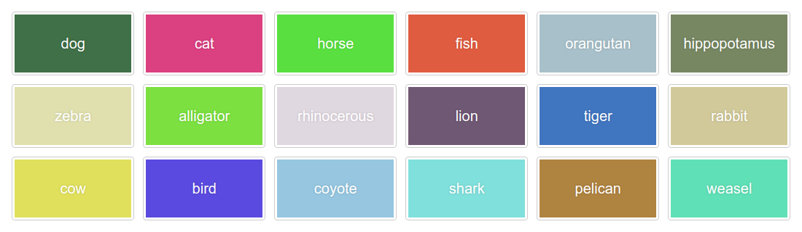

Colorizer
=========

<p align="center">
    
</p>

<p align="center">
    <a href="https://github.com/PHLAK/Colorizer/discussions"></a>
    <a href="https://github.com/users/PHLAK/sponsorship"></a>
    <a href="https://paypal.me/ChrisKankiewicz"></a>
    <br>
    <a href="https://packagist.org/packages/PHLAK/Colorizer"></a>
    <a href="https://packagist.org/packages/PHLAK/Colorizer"></a>
    <a href="https://github.com/PHLAK/Colorizer/blob/master/LICENSE"></a>
    <a href="https://github.com/PHLAK/Colorizer/actions"></a>
</p>


<p align="center">
    Generate persistently unique colors from a string.
    <br>
    Created by <a href="https://www.ChrisKankiewicz.com">Chris Kankiewicz</a> (<a href="https://twitter.com/PHLAK">@PHLAK</a>)
</p>

---

Requirements
------------

  - [PHP](https://php.net) >= 8.1

Install with Composer
---------------------

```bash
composer require phlak/colorizer
```

Usage
-----

```php
// Import Colorizer
use PHLAK\Colorizer;

// Initialize Colorizer
$colorize = new Colorizer\Colorize();

// Generate a Color object from 'foo'
$color = $colorize->text('foo'); // Returns a new Color object

// Get the red, green and blue values
$color->red;    // 165
$color->green;  // 196
$color->blue;   // 254

// Generate a hex color code
$color->hex();  // Returns '#a5c4fe'

// Generate a RGB color code
$color->rgb();  // Returns 'rgb(165, 196, 254)'
```

#### Normalizing Colors

You can enforce RGB values to fall within a certain range to prevent colors
from being too bright or dark.  This is possible by passing minimum and maximum
normalization values (0-255) to the Colorize class on initialization:

```php
$colorize = new Colorizer\Colorize(64, 224);
```

or fluently:

```php
$colorize->text('foo')->normalize(64, 224)->rgb();  // Returns 'rgb(165, 196, 224)'
```

Changelog
---------

A list of changes can be found on the [GitHub Releases](https://github.com/PHLAK/Colorizer/releases) page.

Troubleshooting
---------------

For general help and support join our [GitHub Discussion](https://github.com/PHLAK/Colorizer/discussions)
or reach out on [Bluesky](https://bsky.app/profile/phlak.dev).

Please report bugs to the [GitHub Issue Tracker](https://github.com/PHLAK/Colorizer/issues).

Copyright
---------

This project is licensed under the [MIT License](https://github.com/PHLAK/Colorizer/blob/master/LICENSE).
